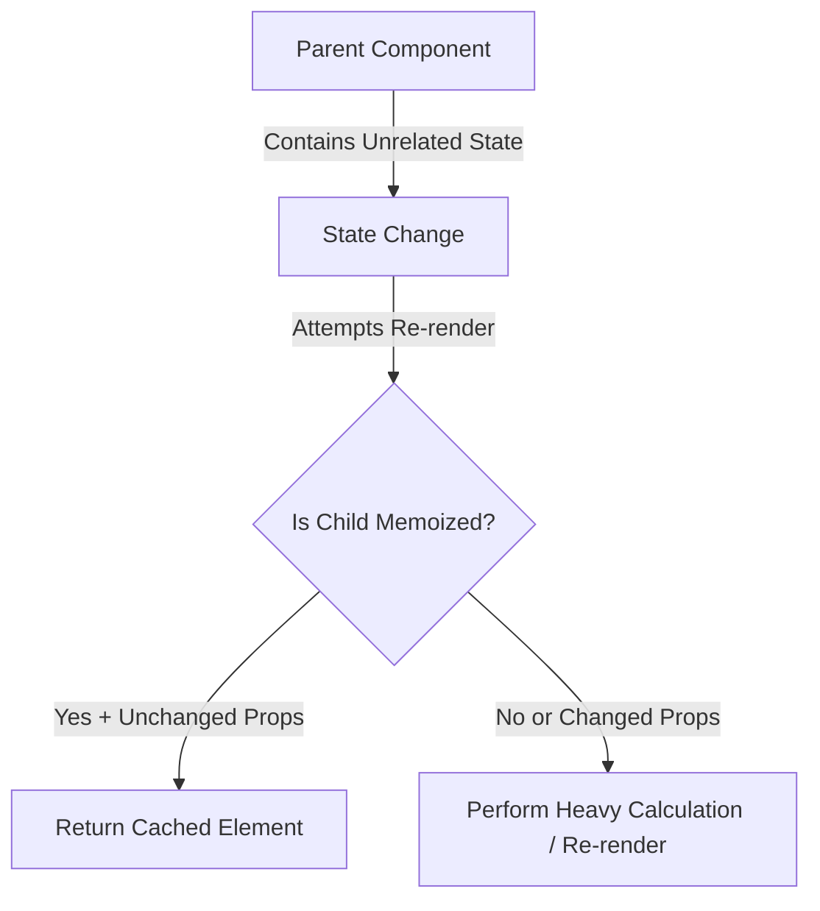

# Experiment 7: Performance Optimization

<div align="center">
  
  
</div>

## Project Overview

This repository contains the codebase for **Performance Optimization in React**, implemented as part of the College Experiment of Full Stack 2 curriculum. The objective of this experiment is to utilize specialized hooks (`useMemo`, `useCallback`, and `React.memo`) to aggressively eliminate unnecessary render cycles.

## Architecture & Data Flow



## Core Components

| Component | Responsibility | Technologies Used |
|-----------|----------------|-------------------|
| `HeavyList` | Wrapped in `React.memo` to skip processing on identical prop reception | React |
| `useMemo` | Caches derived arrays and complex objects directly in memory | React Hooks |
| `useCallback` | Retains referential equality for event handlers passed in the component tree | React Hooks |

## Key Features

- **Render Avoidance**: Block downstream updates dynamically using memoization.
- **Reference Preservation**: Preventing anonymous function re-declarations from breaking cache layers.
- **Value Caching**: Running intensive loops only when specific reactive dependencies shift.

## Getting Started

### Prerequisites
- Node.js (v16 or higher)

### Installation
```bash
npm install
npm run dev
```


## Source Code (`App.tsx`)

```tsx
import { useState, useMemo, useCallback, memo } from 'react';
import './App.css';

// Memoized Child Component
const HeavyList = memo(({ items, onItemClick }: { items: string[], onItemClick: (item: string) => void }) => {
  console.log('Rendering HeavyList...');
  return (
    <ul className="list">
      {items.map((item, index) => (
        <li key={index} onClick={() => onItemClick(item)} className="list-item">
          {item}
        </li>
      ))}
    </ul>
  );
});

function App() {
  const [count, setCount] = useState(0);
  const [query, setQuery] = useState('');

  const allItems = useMemo(() => [
    'Optimization', 'Memoization', 'Performance', 'React', 'Virtualization', 
    'Lazy Loading', 'Code Splitting', 'Hydration', 'Suspense', 'Profiling'
  ], []);

  const filteredItems = useMemo(() => {
    console.log('Filtering items...');
    return allItems.filter(item => item.toLowerCase().includes(query.toLowerCase()));
  }, [allItems, query]);

  const handleItemClick = useCallback((item: string) => {
    alert(`Clicked: ${item}`);
  }, []);

  return (
    <div className="performance-lab">
      <h1>Experiment 5: Performance Optimization</h1>
      <p>Using <code>memo</code>, <code>useMemo</code>, and <code>useCallback</code> to prevent unnecessary re-renders.</p>

      <div className="input-group">
        <input 
          type="text" 
          placeholder="Filter items..." 
          value={query}
          onChange={(e) => setQuery(e.target.value)}
        />
        <div className="counter-box">
          <p>Unrelated State (Count): {count}</p>
          <button onClick={() => setCount(c => c + 1)}>Increment Count</button>
        </div>
      </div>

      <div className="result-section">
        <h3>Resource Items</h3>
        <HeavyList items={filteredItems} onItemClick={handleItemClick} />
      </div>
    </div>
  );
}

export default App;

```
